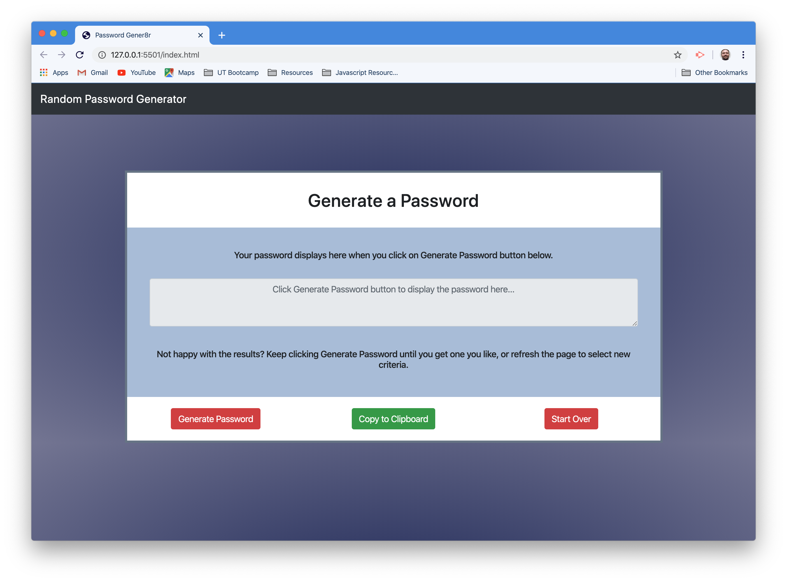

# Unit 03 JavaScript Homework: Password Generator

## Story

As a user with access to sensitive data, I want to randomly generate a password that meets certain criteria so that I can create a strong password that provides greater security.

## Business Context

For companies that handle large amounts of sensitive data, weak passwords can pose a real security threat. An application that can generate strong passwords quickly and effortlessly saves employees time and ensures secure access to data.

## Criteria

Given that a user needs a new, secure password, there should be a prompt to ask for password criteria, then a password is generated.

- - -
## Description

This application generates a random password based on user-selected criteria. This app will run in the browser and features dynamically updated HTML and CSS powered by  JavaScript code.

The user will be prompted to choose from the following password criteria:

* Length (must be between 8 and 128 characters)

* Character type:

  * Special characters ([see examples](https://www.owasp.org/index.php/Password_special_characters))

  * Numeric characters

  * Lowercase characters

  * Uppercase characters

The application validates user input to ensures that at least one character type is selected.

Once all prompts are answered, the user is presented with a password matching the answered prompts. 

User has the option to click a button to copy the password to their clipboard.

The application has a clean and polished user interface and is responsive, ensuring that it adapts to multiple screen sizes.

The application is deployed to GitHub Pages.

Link to the deployed GitHub Pages URL:
https://github.com/duquetteman/password-generator

Screenshot of finished project:

)

Special thanks goes to Kevin Geary, Israel Medina, Brittany Taylor, and Luke Duquette for their collaboration, direction, assistance, and encouragement. 

- - -
